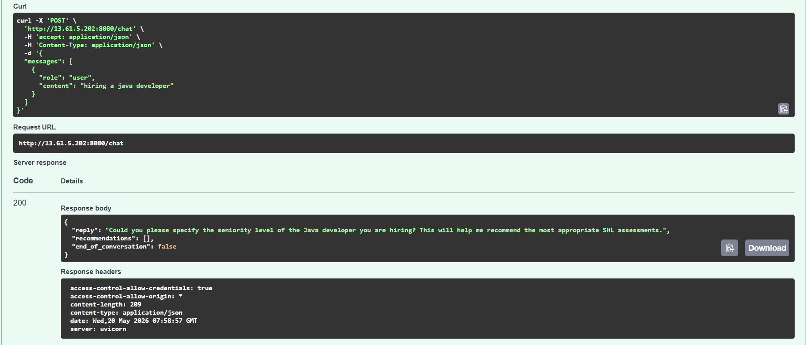
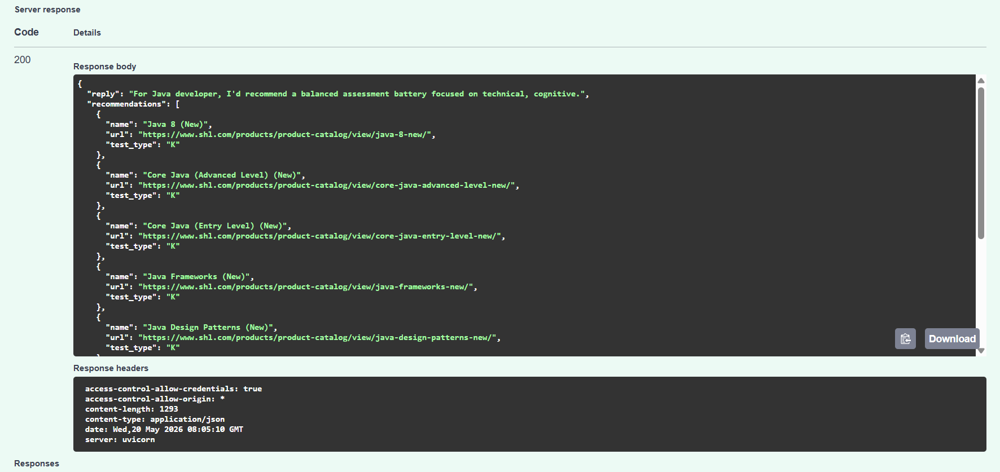
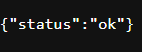

# 🚀 SHL Assessment Recommendation Agent

> A production-grade conversational RAG system that intelligently recommends SHL assessments based on recruiter hiring requirements using Hybrid Retrieval, ChromaDB, FastAPI, OpenRouter LLMs, and AWS EC2 deployment.

---

# 🌐 Live Deployment

## Public API

```bash
http://13.61.5.202:8080
```

## Swagger Docs

```bash
http://13.61.5.202:8080/docs
```
<p align="center">
  
</p>

<p align="center">
  
</p>
## Health Endpoint

```bash
GET /health
```

<p align="center">
  
</p>
## Chat Endpoint

```bash
POST /chat
```

---

# 🧠 What This Project Does

This system acts as an AI-powered recruiter assistant capable of:

✅ Understanding hiring requirements conversationally
✅ Extracting recruiter intent
✅ Clarifying ambiguous hiring requests
✅ Performing hybrid semantic + keyword retrieval
✅ Recommending SHL assessments intelligently
✅ Supporting production-ready API deployment
✅ Running fully containerized on AWS EC2

The project combines:

* Conversational AI
* Retrieval-Augmented Generation (RAG)
* Hybrid Search
* Vector Databases
* LLM reasoning
* Dockerized deployment
* Cloud infrastructure

---

# 🔥 Core Features

## 🤖 Conversational Recruiter Agent

Understands natural recruiter queries like:

```text
Hiring a mid-level Java developer with strong problem solving skills.
```

or:

```text
Need assessments for a sales manager with leadership and behavioral evaluation.
```

---

## 🧩 Intelligent Clarification Flow

If recruiter intent is incomplete, the system asks follow-up questions.

### Example

### Input

```json
{
  "messages": [
    {
      "role": "user",
      "content": "Hiring a software engineer"
    }
  ]
}
```

### Output

```json
{
  "reply": "Could you specify the experience level or technical skills required?",
  "recommendations": [],
  "end_of_conversation": false
}
```

---

## ⚡ Hybrid Retrieval Engine

The retrieval system combines:

### 🔹 Semantic Search

Powered by:

```text
sentence-transformers/all-MiniLM-L6-v2
```

Captures:

* contextual meaning
* role similarity
* behavioral relevance
* intent semantics
* hiring domain similarity

---

### 🔹 BM25 Keyword Retrieval

Captures:

* exact technologies
* recruiter terminology
* hard skills
* assessment terminology

Examples:

```text
Java
Spring Boot
SQL
Leadership
Cognitive reasoning
Behavioral analysis
```

---

### 🔹 Reciprocal Rank Fusion (RRF)

Semantic and BM25 retrieval results are merged using:

```text
Reciprocal Rank Fusion
```

Weights:

```python
SEMANTIC_WEIGHT = 0.7
KEYWORD_WEIGHT = 0.3
```

This significantly improves retrieval quality.

---

# 🧱 System Architecture

## High-Level Pipeline

```text
Recruiter Query
       ↓
Decision Engine
       ↓
Conversation State Builder
       ↓
Constraint Extraction
       ↓
Hybrid Retrieval
 ┌───────────────────────┐
 │ Semantic Search       │
 │ BM25 Retrieval        │
 └───────────────────────┘
       ↓
Reciprocal Rank Fusion
       ↓
Assessment Composer
       ↓
Recommendation Generator
       ↓
Final SHL Assessment Battery
```

---

# 🏗️ Project Structure

```text
rag-shl-project/
│
├── agent/
│   ├── archetypes.py
│   ├── assessment_composer.py
│   ├── conversation_state.py
│   ├── decision_engine.py
│   ├── product_graph.py
│   ├── rationale_generator.py
│   ├── response_generator.py
│   └── workflow_reasoner.py
│
├── api/
│   ├── main.py
│   └── schemas.py
│
├── retrieval/
│   ├── bm25_store.py
│   ├── bucket_retriever.py
│   ├── query_expander.py
│   ├── reranker.py
│   ├── retrieval_pipeline.py
│   ├── rrf.py
│   ├── semantic_retriever.py
│   └── vector_store.py
│
├── ingestion/
│   └── ingestion_pipeline.py
│
├── chroma_db/
├── data/
│
├── Dockerfile
├── requirements.txt
├── .dockerignore
└── README.md
```

---

# 🧠 Conversational Intelligence Layer

## Decision Engine

The decision engine determines whether the system should:

* clarify
* retrieve
* compare
* refuse

### Example Decision Output

```python
{
  "action": "retrieve",
  "reply": "Retrieving assessments for a mid-level Java developer.",
  "reason": "Enough hiring information is available."
}
```

---

# 🔍 Retrieval Pipeline Deep Dive

## Step 1 — Query Expansion

The recruiter request is expanded into retrieval-friendly queries.

### Input

```text
Hiring a mid-level Java developer
```

### Expanded Query

```python
{
  "expanded_query": "java developer java mid level",
  "keywords": ["java developer", "java", "mid level"]
}
```

---

## Step 2 — Bucket Retrieval

The request is split into retrieval buckets.

### Example

```python
{
  "type": "technical",
  "query": "java"
}

{
  "type": "cognitive",
  "query": "cognitive aptitude logical reasoning problem solving"
}
```

---

## Step 3 — Semantic Retrieval

Uses ChromaDB vector similarity search.

---

## Step 4 — BM25 Retrieval

Performs exact keyword retrieval.

---

## Step 5 — Reciprocal Rank Fusion

Combines semantic + BM25 results.

---

## Step 6 — Re-ranking

Results are reranked using hiring intent.

---

## Step 7 — Final Assessment Composition

Creates a balanced recommendation battery.

Includes:

* technical assessments
* cognitive assessments
* personality assessments
* simulations

---

# 📦 ChromaDB + Embeddings

## Embedding Model

Final production model:

```text
sentence-transformers/all-MiniLM-L6-v2
```

---

## Why MiniLM?

Initially tested:

```text
BAAI/bge-m3
```

Problems encountered:

❌ High RAM usage
❌ EC2 crashes
❌ Slow cold starts
❌ Docker instability
❌ Large embedding dimensions

MiniLM was selected because:

✅ Lightweight
✅ Fast inference
✅ Stable on t3.medium
✅ Deployment-friendly
✅ Lower memory footprint

---

# 🐳 Docker Deployment

## Build Image

```bash
docker build -t shl-agent .
```

---

## Run Container

```bash
docker run -d \
-p 8080:8080 \
-e OPENROUTER_API_KEY=your_key \
--name shl-agent-container \
shl-agent
```

---

# ☁️ AWS EC2 Deployment

## Recommended Instance

```text
t3.medium
```

Minimum:

* 2 vCPU
* 4 GB RAM

---

## Install Docker

```bash
sudo apt update
sudo apt install docker.io -y
```

---

## Start Docker

```bash
sudo systemctl start docker
```

---

## Open Security Group

Add inbound rule:

| Type       | Port |
| ---------- | ---- |
| Custom TCP | 8080 |

Source:

```text
0.0.0.0/0
```

---

# ⚙️ Installation Guide

## Clone Repository

```bash
git clone <repo-url>
cd rag-shl-project
```

---

## Create Virtual Environment

### Windows

```bash
python -m venv .venv
.venv\Scripts\activate
```

### Linux / Mac

```bash
python3 -m venv .venv
source .venv/bin/activate
```

---

## Install Dependencies

```bash
pip install -r requirements.txt
```

---

# 🔐 Environment Variables

Create:

```text
.env
```

Add:

```env
OPENROUTER_API_KEY=your_key_here
```

---

# 📚 Ingestion Pipeline

Run:

```bash
python ingestion/ingestion_pipeline.py
```

The ingestion pipeline:

✅ Downloads SHL catalog
✅ Cleans metadata
✅ Generates embeddings
✅ Creates ChromaDB collections
✅ Persists vector store

---

# 🧪 Running Locally

```bash
uvicorn api.main:app --reload
```

Open:

```text
http://localhost:8000/docs
```

---

# 📡 API Documentation

## Health Endpoint

```http
GET /health
```

### Response

```json
{
  "status": "ok"
}
```

---

## Chat Endpoint

```http
POST /chat
```

### Request Example

```json
{
  "messages": [
    {
      "role": "user",
      "content": "Hiring a mid-level Java developer with strong cognitive ability"
    }
  ]
}
```

---

## Example Successful Response

```json
{
  "reply": "Here are the top SHL assessments for this role.",
  "recommendations": [
    {
      "name": "Java Technical Assessment",
      "url": "https://example.com",
      "test_type": "K"
    }
  ],
  "end_of_conversation": true
}
```

---

# 🧠 Recommendation Composition Logic

The agent intelligently builds balanced assessment batteries.

Possible dimensions:

* Technical
* Cognitive
* Personality
* Simulations

The system:

✅ deduplicates recommendations
✅ enriches assessments
✅ generates rationales
✅ supports workflow-specific recommendations

---

# 📸 Recommended README Screenshots

Add screenshots for:

## 1. Swagger UI

```text
/docs endpoint
```

---

## 2. Docker Running Container

```bash
sudo docker ps
```

---

## 3. Successful API Response

Show:

* recommendations
* response JSON
* retrieval results

---

## 4. EC2 Deployment

Include:

* EC2 dashboard
* security groups
* public IP deployment

---

## 5. Retrieval Logs

Include:

```text
Semantic Results: 20
BM25 Results: 10
Final Results: 10
```

## 3. Docker Container Editing

### Lesson Learned

Changes inside running containers are NOT persisted to GitHub automatically.

Workflow:

```bash
container → EC2 host → git repo → GitHub
```

---

## 4. GitHub Authentication

GitHub no longer supports password authentication.

Use:

✅ Personal Access Tokens (PAT)
OR
✅ SSH authentication

---

# 📈 Evaluation Scenarios

Tested with:

✅ Java developer hiring
✅ Sales manager roles
✅ Data science hiring
✅ Cognitive assessment requests
✅ Behavioral assessment flows
✅ Multi-turn recruiter conversations

Evaluation criteria:

* retrieval quality
* recommendation quality
* ranking relevance
* latency
* deployment stability
* conversational flow

---

# 🚀 Future Improvements

## Planned Enhancements

* Redis memory
* Session persistence
* Streaming responses
* Frontend UI
* Kubernetes deployment
* GPU inference
* Cross-encoder reranking
* Better evaluation datasets
* Human feedback loops
* LangSmith tracing
* Analytics dashboard

---

# 🧠 Engineering Lessons Learned

Major challenges solved:

✅ ChromaDB persistence issues
✅ Metadata normalization
✅ Docker optimization
✅ EC2 memory constraints
✅ Retrieval balancing
✅ Hybrid search architecture
✅ Production deployment debugging
✅ GitHub authentication migration

---

# 🎯 Final Outcome

The system successfully:

✅ Extracts recruiter intent
✅ Clarifies missing information
✅ Performs hybrid retrieval
✅ Recommends SHL assessments
✅ Supports conversational interaction
✅ Runs fully containerized
✅ Deploys publicly on AWS EC2
✅ Exposes production-grade APIs

---

# 👨‍💻 Author

Built as a production-ready conversational RAG system for SHL assessment recommendation workflows using:

* FastAPI
* ChromaDB
* Hybrid Retrieval
* OpenRouter LLMs
* Docker
* AWS EC2
* LangChain

---

# ⭐ If You Like This Project

Give it a ⭐ on GitHub and feel free to fork, improve, and build on top of it.

---

# 🖤 Built With

```text
FastAPI + ChromaDB + LangChain + OpenRouter + Docker + AWS EC2
```
